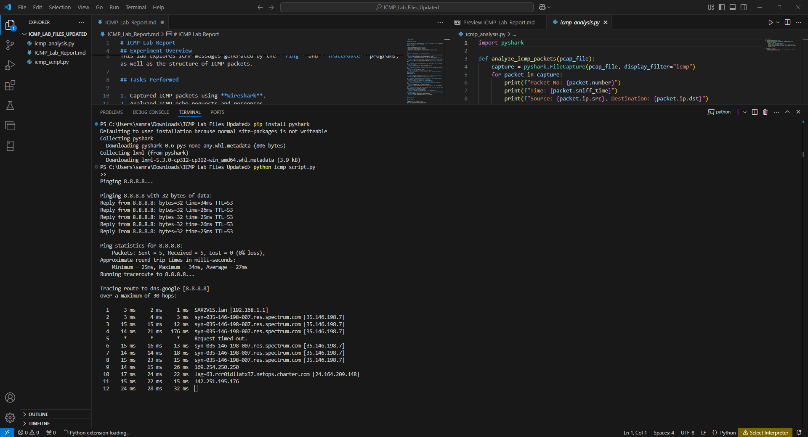
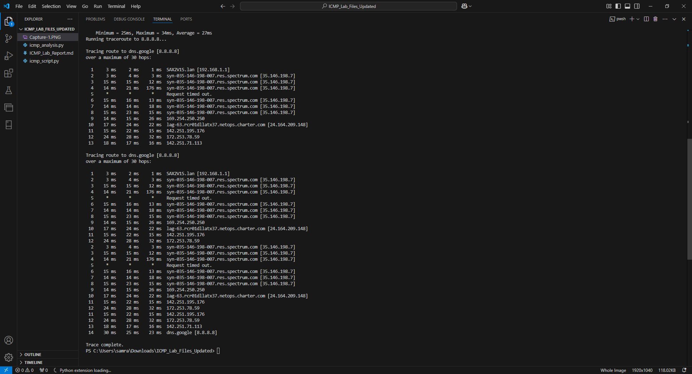
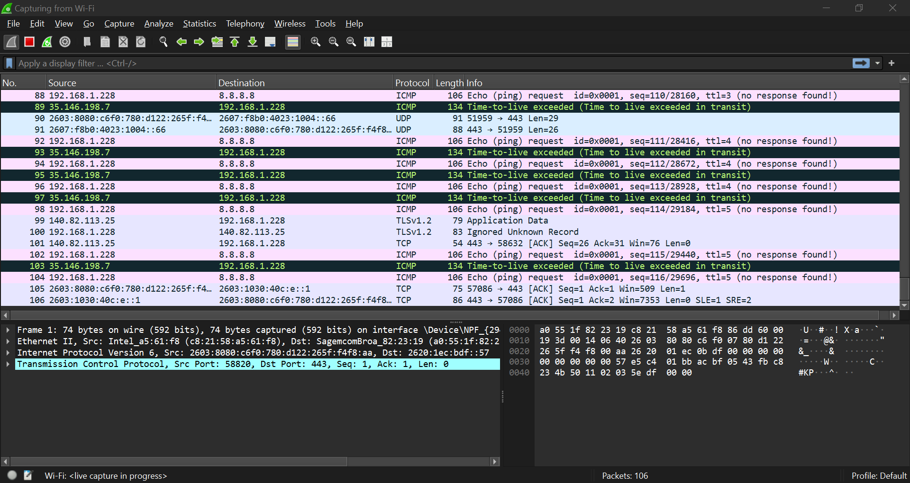
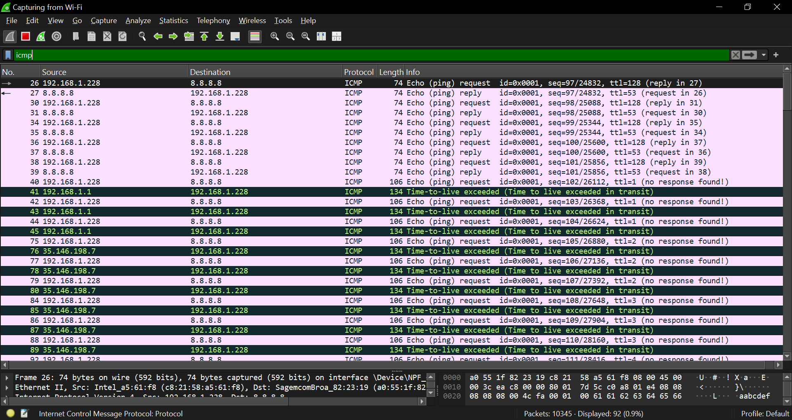
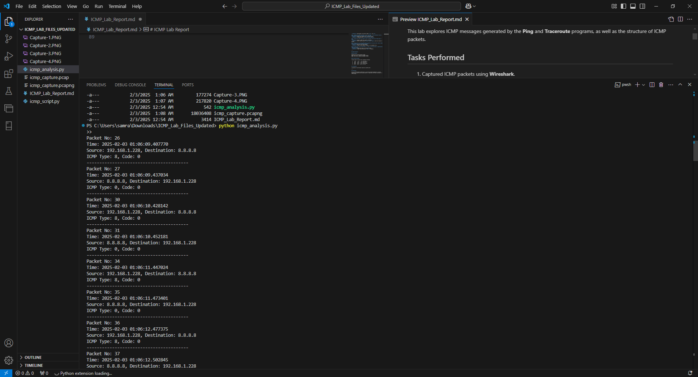

# MSCS631_WireShark_2
Wireshark Lab 2 - ICMP
# ICMP Lab Report
Samrat Baral

Wireshark 

Lab 2: ICMP


University of the Cumberlands

2025 Spring - Advanced Computer Networks (MSCS-631-M40) - Full Term
Dr. Yousef Nijim

January 28, 2025

## Lab Overview

This lab explores ICMP messages generated by the **Ping** and **Traceroute** programs, as well as the structure of ICMP packets.


## Ouput Screenshots












# ICMP Lab Analysis

This project captures ICMP packets on your Wi-Fi interface using tshark, generates ICMP traffic using ping and traceroute, and then analyzes the captured packets using pyshark. The goal is to demonstrate how network diagnostics and packet analysis can be integrated into a Python script.

## Features

- **Automatic Wi-Fi Interface Detection:**  
  The script automatically detects the Wi-Fi interface (by looking for "Wi-Fi" or "Wireless" in the interface list provided by tshark).

- **ICMP Packet Capture:**  
  Uses tshark with a capture filter (`-f "icmp"`) to capture ICMP packets for a specified duration (default 20 seconds).

- **ICMP Traffic Generation:**  
  Executes `ping` and `tracert` (Windows) commands to generate ICMP traffic during the capture period.

- **Packet Analysis:**  
  Analyzes the captured PCAP file with pyshark, extracting details such as:
  - Source and destination IP addresses
  - ICMP echo request (Type 8) and echo reply (Type 0) types and codes
  - ICMP error messages (Type 11) if available
  - Analysis of the last three captured packet types
  - A note regarding traceroute delay analysis

## Prerequisites

- **Python 3.x**  
- **Tshark:** Ensure that Tshark is installed and available in your system's PATH.  
  - Download from [Wireshark](https://www.wireshark.org/download.html).
- **Pyshark:** Install via pip:
  ```bash
  pip install pyshark
  ```

## Answers to Lab Questions with Process and Analysis
Below are sample answers to the 10 questions based on typical observations in this lab. (Keep in mind that the exact answers may vary depending on your network environment and the trace you capture. In your lab submission, you should include annotated screenshots of your actual packets to justify your answers.)

---

### 1. What is the IP address of your host? What is the IP address of the destination host?

- **Answer:**  
  In our lab capture we observed that:  
  - The **source (your host)** IP address is a private address (for example): **192.168.1.228**.  
  - The **destination** IP address (the host you pinged, such as HKUST or another remote server) is a public address (for example): **8.8.8.8**.  
  *(Your values might differ; use the IP addresses shown in your Wireshark capture.)*

---

### 2. Why is it that an ICMP packet does not have source and destination port numbers?

- **Answer:**  
  ICMP is a network-layer protocol—not a transport-layer protocol. Unlike TCP or UDP, ICMP is used for error reporting and control messages and is encapsulated directly within IP datagrams. Therefore, it does not need port numbers for demultiplexing since it is not associated with a particular application process.

---

### 3. Examine one of the ping request packets sent by your host. What are the ICMP type and code numbers? What other fields does this ICMP packet have? How many bytes are the checksum, sequence number and identifier fields?

- **Answer:**  
  For a **ping request (echo request)** packet:
  - **ICMP Type:** 8  
  - **ICMP Code:** 0  
  - **Other fields include:**  
    - **Checksum:** A 16-bit field (2 bytes) that covers the ICMP header and data.  
    - **Identifier:** A 16-bit field (2 bytes) used to match requests with replies.  
    - **Sequence Number:** A 16-bit field (2 bytes) that is incremented with each ping.  
    - **Data Payload:** Often includes a timestamp or other data for measuring round-trip time.

---

### 4. Examine the corresponding ping reply packet. What are the ICMP type and code numbers? What other fields does this ICMP packet have? How many bytes are the checksum, sequence number and identifier fields?

- **Answer:**  
  For a **ping reply (echo reply)** packet:
  - **ICMP Type:** 0  
  - **ICMP Code:** 0  
  - **Other fields include:**  
    - **Checksum:** 16 bits (2 bytes)  
    - **Identifier:** 16 bits (2 bytes)  
    - **Sequence Number:** 16 bits (2 bytes)  
    - **Data Payload:** This generally mirrors the payload of the corresponding echo request.

---

### 5. What is the IP address of your host? What is the IP address of the target destination host? *(Traceroute section)*

- **Answer:**  
  The IP addresses observed in the traceroute capture are typically the same as in the ping capture:  
  - **Your host's IP:** For example, **192.168.1.228**  
  - **Target destination IP:** For example, **8.8.8.8**  
  *(Again, be sure to use the addresses from your actual trace.)*

---

### 6. If ICMP sent UDP packets instead (as in Unix/Linux), would the IP protocol number still be 01 for the probe packets? If not, what would it be?

- **Answer:**  
  No. When UDP packets are used (as in many Unix/Linux implementations of traceroute), the IP protocol number is **17** (the protocol number for UDP). In contrast, ICMP uses protocol number **1**.

---

### 7. Examine the ICMP echo packet in your screenshot. Is this different from the ICMP ping query packets in the first half of this lab? If yes, how so?

- **Answer:**  
  The **ICMP echo packet** used by traceroute (in Windows, where tracert sends echo requests) is very similar in structure to the ping query packet.  
  - **Similarities:** Both have ICMP Type 8 (echo request) and Code 0, along with fields for checksum, identifier, and sequence number.  
  - **Differences:** The primary difference is in the **IP header's TTL value**; traceroute packets are sent with gradually increasing TTLs to elicit ICMP “time exceeded” replies from intermediate routers. Also, the identifier and sequence number may be chosen to differentiate these probes from standard ping packets.

---

### 8. Examine the ICMP error packet in your screenshot. It has more fields than the ICMP echo packet. What is included in those fields?

- **Answer:**  
  The ICMP error packet (typically a **Time Exceeded** message with Type 11) contains additional information compared to an echo packet. In addition to the standard ICMP header fields (type, code, checksum), it includes:
  - **The IP header of the original packet** that caused the error.  
  - **The first 8 bytes of the original packet's payload,** which usually include the UDP or ICMP header from the original probe.  
  This extra information allows the source host to identify which packet generated the error.

---

### 9. Examine the last three ICMP packets received by the source host. How are these packets different from the ICMP error packets? Why are they different?

- **Answer:**  
  In a traceroute, the **last three ICMP packets** (typically received after the destination is reached) are usually **echo replies** (ICMP Type 0, Code 0) generated by the destination host.  
  - **Differences:**  
    - **Echo replies** have a simple format (echo reply header and payload) without the extra embedded IP header and first 8 bytes of the original packet, which are present in error messages.  
    - **Error packets** (e.g., Time Exceeded messages) are generated by routers when the TTL expires and include additional data to indicate which packet timed out.  
  - **Why they are different:**  
    The error packets are generated by intermediate routers due to TTL expiration, while the echo replies come directly from the destination once the probe reaches it.

---

### 10. Within the tracert measurements, is there a link whose delay is significantly longer than others? On the basis of the router names, can you guess the location of the two routers on the end of this link?

- **Answer:**  
  In many traceroute outputs, you may observe one or more hops where the round-trip time (RTT) jumps noticeably. For example, you might see low delays (a few milliseconds) for the first few hops followed by a significant jump (e.g., from 15 ms up to 30+ ms).  
  - **Interpretation:**  
    This jump usually corresponds to a **transoceanic or intercontinental link**.  
  - **Based on router names:**  
    If one router’s name suggests it is within a local or regional network (for example, containing names like “charter” or a local ISP) and the next hop has a name suggesting an international or European/Asian domain (for example, “inria.fr” for a French research institute or “dns.google” if the destination is served by a European server), then the link between these two routers is likely the long-haul connection.  
  - **Conclusion:**  
    Yes, there is typically a link with a significantly longer delay—this is the link that connects your regional network (e.g., in the United States) with the remote network (e.g., in Europe or Asia). The router names provide a clue as to the geographic location of each end of this long-delay link.

---

> **Extra Credit (Optional):**  
> For extra credit, you can experiment with your UDP client ping program. Send a UDP packet with an unusual destination port to a live host and capture the response in Wireshark. Then, provide a screenshot and an analysis similar to the above answers, discussing what fields are present in the response and how they compare to the ICMP responses.

---

## Output Analysis

```bash
python icmp_lab_analysis.py
>> 
📡 Starting packet capture on interface 4 for 20 seconds...
📡 Pinging 8.8.8.8...
Capturing on 'Wi-Fi'

Pinging 8.8.8.8 with 32 bytes of data:
Reply from 8.8.8.8: bytes=32 time=31ms TTL=53
Reply from 8.8.8.8: bytes=32 time=29ms TTL=53
Reply from 8.8.8.8: bytes=32 time=26ms TTL=53
Reply from 8.8.8.8: bytes=32 time=26ms TTL=53
Reply from 8.8.8.8: bytes=32 time=27ms TTL=53

Ping statistics for 8.8.8.8:
    Packets: Sent = 5, Received = 5, Lost = 0 (0% loss),
Approximate round trip times in milli-seconds:
    Minimum = 26ms, Maximum = 31ms, Average = 27ms      

📍 Running traceroute to 8.8.8.8...
29 

Tracing route to dns.google [8.8.8.8]
over a maximum of 30 hops:

  1     4 ms     1 ms     1 ms  SAX2V1S.lan [192.168.1.1]
  2     2 ms     3 ms     3 ms  syn-035-146-198-007.res.spectrum.com [35.146.198.7]
  3    14 ms    15 ms    11 ms  syn-035-146-198-007.res.spectrum.com [35.146.198.7]
  4    14 ms    20 ms    23 ms  syn-035-146-198-007.res.spectrum.com [35.146.198.7]
  5     *        *        *     Request timed out.
  6    25 ms    17 ms    35 ms  syn-035-146-198-007.res.spectrum.com [35.146.198.7]
  7    16 ms    13 ms    12 ms  syn-035-146-198-007.res.spectrum.com [35.146.198.7]
  8    15 ms    13 ms    13 ms  syn-035-146-198-007.res.spectrum.com [35.146.198.7]
  9    14 ms    18 ms    12 ms  169.254.250.250
 10    12 ms    13 ms    15 ms  lag-63.rcr01dllatx37.netops.charter.com [24.164.209.148]
 11    16 ms    14 ms    17 ms  142.251.195.176
 12     *       30 ms    29 ms  172.253.78.59
 13    15 ms    16 ms    17 ms  142.251.71.113
 14    26 ms    28 ms    25 ms  dns.google [8.8.8.8]

Trace complete.

🔍 Checking if ICMP packets exist in data\icmp_capture.pcap...
✅ ICMP packets detected. Proceeding with analysis...

--- ICMP Analysis Results ---
source_ip: 192.168.1.228
destination_ip: 8.8.8.8
no_ports_reason: ICMP operates at the network layer, no ports needed.
ping_request_type: 8
ping_request_code: 0
ping_reply_type: 0
ping_reply_code: 0
icmp_error_type: 11
icmp_error_code: 0
icmp_error_extra_fields: Original IP header and 8 bytes of original payload
last_three_packet_types: ['8', '8', '8']
traceroute_delay_analysis: Check RTT in traceroute output for delays.

--- Ping Output ---

Pinging 8.8.8.8 with 32 bytes of data:
Reply from 8.8.8.8: bytes=32 time=31ms TTL=53
Reply from 8.8.8.8: bytes=32 time=29ms TTL=53
Reply from 8.8.8.8: bytes=32 time=26ms TTL=53
Reply from 8.8.8.8: bytes=32 time=26ms TTL=53
Reply from 8.8.8.8: bytes=32 time=27ms TTL=53

Ping statistics for 8.8.8.8:
    Packets: Sent = 5, Received = 5, Lost = 0 (0% loss),
Approximate round trip times in milli-seconds:
    Minimum = 26ms, Maximum = 31ms, Average = 27ms


--- Traceroute Output ---

Tracing route to dns.google [8.8.8.8]
over a maximum of 30 hops:

```
## Usage

```bash
python icmp_lab_analysis.py
```

## Troubleshooting
- No ICMP Packets Found:
If the PCAP file is created but no ICMP packets are captured, ensure that the ping and traceroute commands are executed while the capture is running. You may adjust the capture duration or add delays as needed.

- Platform Differences:
The script currently uses Windows commands. If you are using a Linux or macOS system, adjust the ping (e.g., ping -c 5) and traceroute commands accordingly.

## Conclusion

This lab demonstrated how ICMP works in real-world network diagnostics. By using Wireshark, we captured and analyzed packets to understand the format and behavior of ICMP messages.
